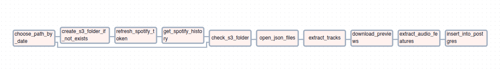
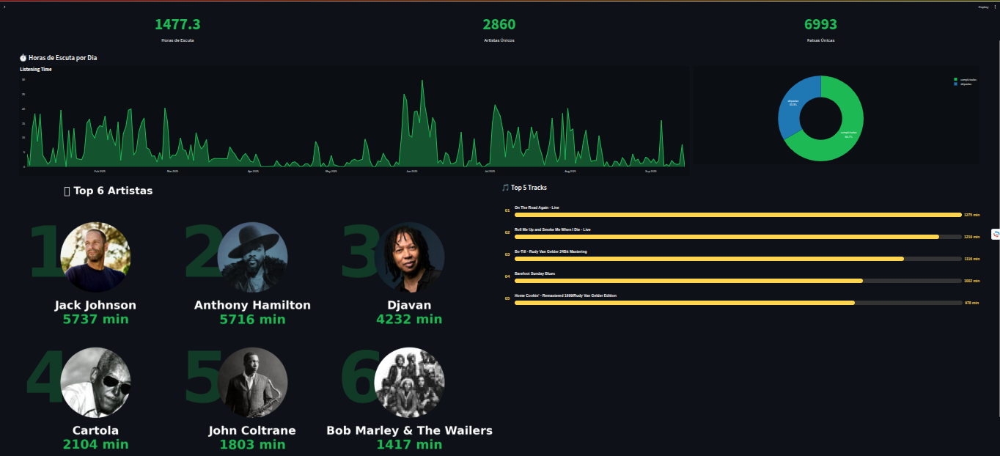
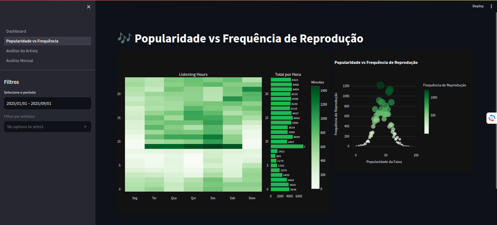
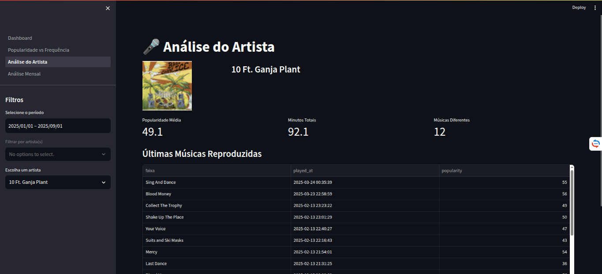
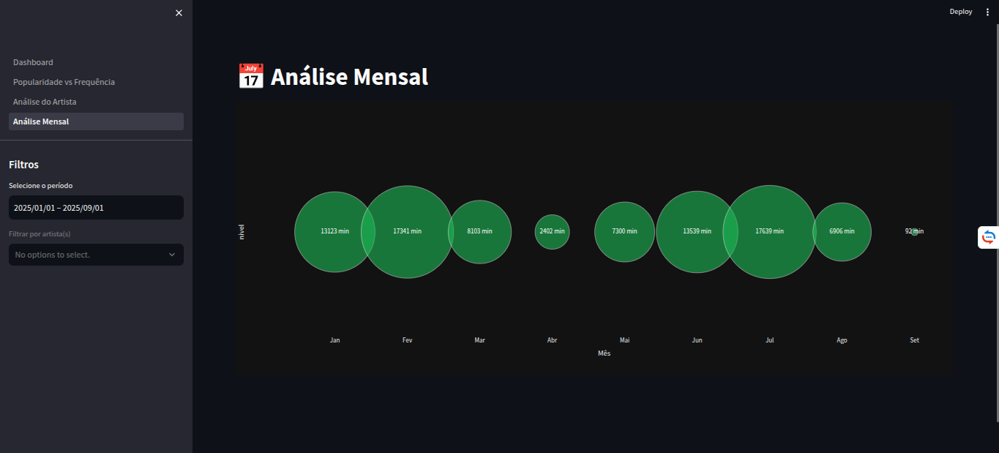

# Spotify Wrapped Pipeline com Airflow

Este projeto nasceu da vontade de recriar, de forma independente, a retrospectiva musical do Spotify (Spotify Wrapped). Este recurso é uma análise dos hábitos musicas dos usuários do serviço, liberado ao final do ano.
A ideia foi construir um **pipeline de dados completo**, passando desde a coleta bruta na API do Spotify até a visualização em um dashboard interativo.

## Motivação

O Spotify Wrapped oficial é anual e limitado. Além disso, você não tem os dados para pesquisa por um período, seja de dias quanto de horário.
Com base neste problemas, eu gostaria:
 - Obter os **meus** dados em tempo real;
 - Ter controle sobre o pipeline;
 - Explorar análises personalizadas: padrões de horário, dias da semana, duração de faixas...
 - Tudo isso demonstrando habilidades de engenharia de dados: Airflow, orquestração, armazenamento, visualização.

## Pipeline de Dados

A orquestração do projeto foi feita no **Apache Airflow**, utilizando uma DAG que automatiza todo o processo de ingestão, transformação e carga.

O pipeline é composto pelas seguintes etapas:

1. **choose_path_by_date**
   Define dinamicamente o caminho no S3 (ou local) onde os dados do dia serão armazenados.

2. **create_s3_folder_if_not_exists**
   Cria a pasta no S3 caso ainda não exista, garantindo a organização por data.

3. **refresh_spotify_token**
   Atualiza o token de autenticação da API do Spotify para permitir novas requisições.

4. **get_spotify_history**
   Consulta a API do Spotify para recuperar o histórico de músicas ouvidas.

5. **check_s3_folder**
   Verifica se o bucket/pasta no S3 contém os arquivos de dados do dia.

6. **open_json_files**
   Abre e lê os arquivos JSON armazenados, preparando para a extração.

7. **extract_tracks**
   Extrai os metadados principais das faixas (artista, álbum, duração, etc.).

8. **download_previews**
   Baixa os trechos de 30 segundos das músicas (quando disponíveis na API).
   > ⚠️ Limitação: nem todas as faixas possuem preview.

9. **extract_audio_features**
   Extrai as *audio features* das faixas (dançabilidade, energia, valência, etc.)
   - Quando disponível, utiliza a API do Spotify.
   - Quando ausente, recorre ao processamento dos previews.

10. **insert_into_postgres**
    Insere os dados tratados em uma base **Postgres** (AWS RDS), estruturada em tabelas relacionais (`artist`, `album`, `track`, `playback_history`).

Esse pipeline garante que, a cada 2 horas, novos dados sejam coletados, enriquecidos e disponibilizados para análise no **dashboard interativo**.

## Dashboard

O Dashboard apresenta os resultados em gráficos interativos:

- **Top 5 artistas e músicas**.
- **Tendência temporal de reproduções**.
- **Distribuição por dias da semana e horários**.
- **Histograma da duração das faixas**.

O objetivo é transformar dados brutos em **insights visuais claros**.

## Limitações da API do Spotify

Durante o desenvolvimento, percebi algumas restrições importantes:
- O histórico fornecido pela API é **limitado às últimas 50 músicas ouvidas** (no endpoint padrão).
- Nem todas as músicas têm **preview de 30 segundos disponível**.
- Algumas *audio features* são acessíveis, mas não há detalhes mais avançados de processamento acústico.

Por isso, o projeto inclui **tratamento de falhas** e complementação com dados externos sempre que possível.

